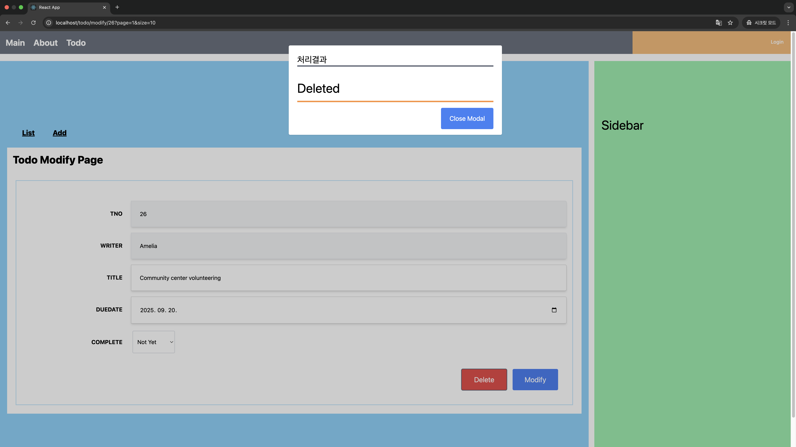

# ShopProject

<br />

http://localhost:80/todo

<br />

## Running Guide

This project is simple project with Java, Spring, JPA, React, Mysql and Docker.


### - Version

- java 21
- spring 3.4.5
- Mysql 8.0.42

<br />

### - Run command

Make sure Docker is running before writing command.

```
rm -rf ./database/store
docker-compose down -v
docker-compose up --build
```
<br />

## Project Architecture


<br />

## Project Image

- TodoList <br />


<br />

- TodoAdd <br />


<br />

- TodoRead <br />


<br />

- TodoModify <br />


<br />

- TodoDelete <br />


<br /><br />


## What I learn from this project(Keep Updating)

처음 Spring 프로젝트를 하다보니, 대부분의 코드를 참고해서 사용하였습니다.
저는 이 과정을 통해 기본적인 컨벤션이나 'Spring Study'를 통해 배웠던 이론적 지식들의 활용 방법을 참고할 수 있었습니다.

### Infrastructure

Docker와 Docker-compose를 이용한 인프라 구성, Nginx의 Proxy 설정, Mysql의 charset설정, CORS(Cross-Origin-Resource Sharing) 설정 등

### Backend

Spring의 전반적인 활용, 개발 모드와 배포 모드의 분리, 계층 구성, 예외처리 등

### Frontend

SPA의 생명주기, axios와 router 설정, hooks, component 조립 등
